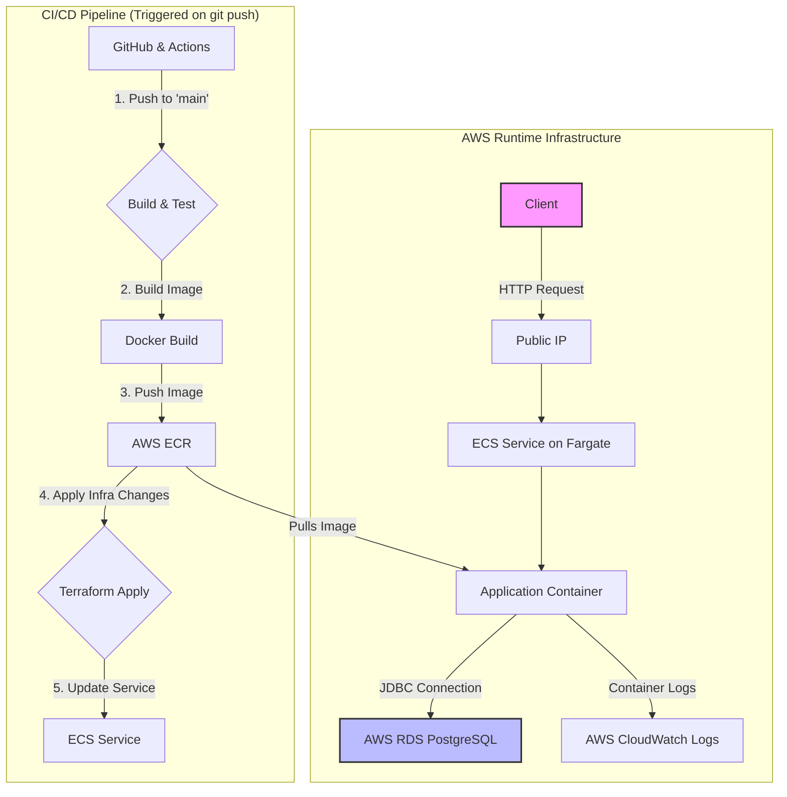

# Product Service

This is a simple CRUD product service built with Spring Boot, Java, and Gradle.

## Prerequisites

- Docker

## Getting Started

This project is configured to run in Docker using a multi-stage build. This is the recommended way to run the application.

To build and run the application and its PostgreSQL database, use the following command:

```bash
docker-compose up --build
```

This single command will:
1.  Build the application's `.jar` file inside a temporary Docker container.
2.  Build the final, lightweight Docker image for the application.
3.  Start the application container and the PostgreSQL database container.

The API will be available at `http://localhost:8080`.

## API Usage

Here are sample `curl` commands for each endpoint.

---


### 1. Get All Products

Retrieves a list of all products.

**Request:**
`GET /products`

**Curl Command:**
```bash
curl -X GET http://localhost:8080/products
```

---


### 2. Get a Single Product by ID

Retrieves the product with the specified ID.

**Request:**
`GET /products/{id}`

**Curl Command (Example using ID 1):**
```bash
curl -X GET http://localhost:8080/products/1
```

---


### 3. Create a New Product

Creates a new product. The new product's data is sent as a JSON payload.

**Request:**
`POST /products`

**Curl Command:**
```bash
curl -X POST http://localhost:8080/products \
-H "Content-Type: application/json" \
-d '{"name":"MacBook Pro", "price":2499.99}'
```

---


### 4. Update an Existing Product

Updates the product with the specified ID.

**Request:**
`PUT /products/{id}`

**Curl Command (Example using ID 1):**
```bash
curl -X PUT http://localhost:8080/products/1 \
-H "Content-Type: application/json" \
-d '{"name":"MacBook Pro M4", "price":2799.99}'
```

---


### 5. Delete a Product

Deletes the product with the specified ID.

**Request:**
`DELETE /products/{id}`

**Curl Command (Example using ID 1):**
```bash
curl -X DELETE http://localhost:8080/products/1
```

---

## Deployed Architecture

The project is configured for continuous deployment to AWS. The following diagram illustrates the CI/CD pipeline and the deployed infrastructure.



## Docker Image for AWS ECR

This section describes how to build the application's Docker image and push it to Amazon Elastic Container Registry (ECR) for deployment.

### Prerequisites

*   Docker installed and running.
*   AWS CLI installed and configured with permissions to push to ECR.

### 1. Build the Docker Image

This project uses a multi-stage Dockerfile, which handles the application build and image creation in a single step. You do not need to build the application with Gradle separately.

```bash
docker build -t product-service .
```

### 2. Push the Image to ECR

Follow these steps to push the image to your ECR repository.

**a. Create the ECR Repository (if it doesn't exist)**
Replace `your-aws-region` with your desired AWS region.

```bash
aws ecr create-repository \
    --repository-name product-service \
    --region your-aws-region
```

**b. Authenticate Docker to the ECR Registry**
Replace `your-aws-account-id` and `your-aws-region`. This command retrieves a temporary token to log Docker in.

```bash
aws ecr get-login-password --region your-aws-region | docker login --username AWS --password-stdin your-aws-account-id.dkr.ecr.your-aws-region.amazonaws.com
```

**c. Tag the Image**
Tag your local image with the full ECR repository URI. Replace `your-aws-account-id` and `your-aws-region`.

```bash
docker tag product-service:latest your-aws-account-id.dkr.ecr.your-aws-region.amazonaws.com/product-service:latest
```

**d. Push the Image**
Push the tagged image to ECR.

```bash
docker push your-aws-account-id.dkr.ecr.your-aws-region.amazonaws.com/product-service:latest
```